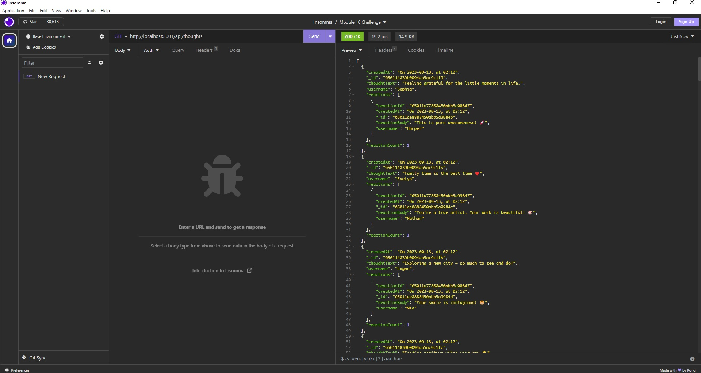

# Module 18 Challenge

# NoSQL: Social Network API

## Description

MongoDB is a popular choice for many social networks due to its speed with large amounts of data and flexibility with unstructured data. Over the last part of this course, you’ll use several of the technologies that social networking platforms use in their full-stack applications. Because the foundation of these applications is data, it’s important that you understand how to build and structure the API first.

My Challenge is to build an API for a social network web application where users can share their thoughts, react to friends’ thoughts, and create a friend list. You’ll use Express.js for routing, a MongoDB database, and the Mongoose ODM. In addition to using the [Express.js](https://www.npmjs.com/package/express) and [Mongoose](https://www.npmjs.com/package/mongoose) packages, you may also optionally use a JavaScript date library of your choice or the native JavaScript `Date` object to format timestamps.

## User Story

```md
AS A social media startup
I WANT an API for my social network that uses a NoSQL database
SO THAT my website can handle large amounts of unstructured data
```

## Acceptance Criteria

```md
GIVEN a social network API
WHEN I enter the command to invoke the application
THEN my server is started and the Mongoose models are synced to the MongoDB database
WHEN I open API GET routes in Insomnia for users and thoughts
THEN the data for each of these routes is displayed in a formatted JSON
WHEN I test API POST, PUT, and DELETE routes in Insomnia
THEN I am able to successfully create, update, and delete users and thoughts in my database
WHEN I test API POST and DELETE routes in Insomnia
THEN I am able to successfully create and delete reactions to thoughts and add and remove friends to a user’s friend list
```

## Install & Run the Application

- Navigate to the develop folder using the command prompt
- npm install (install all packages required)
- npm run seed (seed the database with data)
- node index (run the app server)

## Repository - Link

GITHUB: https://github.com/csetiawan88/socialnetworkapi

## Contributing

csetiawan88 - https://github.com/csetiawan88/

## Screenshot

#### Social Network API




## Walkthrough Video

Video created with Screencastify.

Video Link:

## Technologies

- [Express.js](https://expressjs.com/)
- [Mongoose](https://mongoosejs.com/)

## Questions

If you have any additional questions, you can reach me at:
csetiawan@yahoo.com
